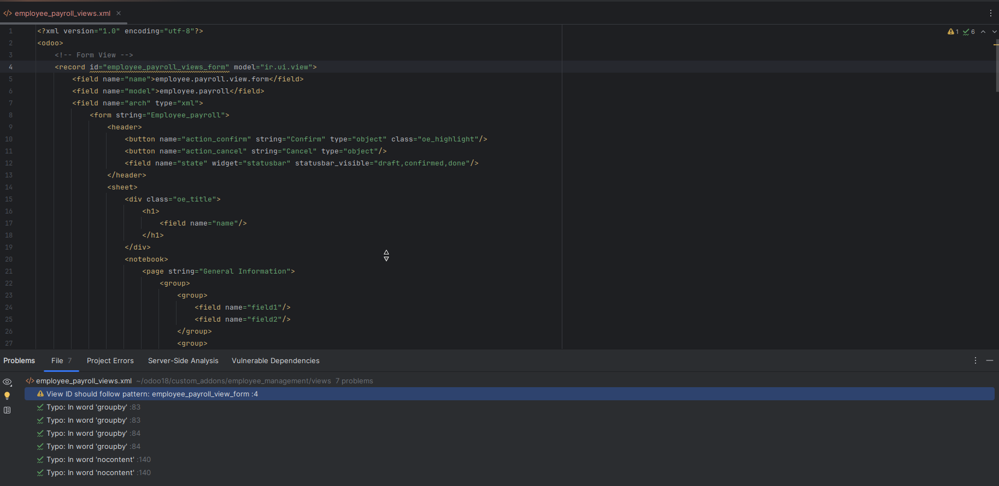

# 📘 Assista Plugin Documentation

<div align="center">


[](https://plugins.jetbrains.com)
[](https://www.odoo.com)
[](https://github.com/CybrosysAssista/Assista-Pycharm)

</div>

## 📋 Table of Contents

- [Overview](#-overview)
- [Features](#-features)
  - [Module Template Generator](#-module-template-generator)
    - [How to Use](#-how-to-use-the-module-template-generator)
    - [Available Templates](#-odoo-module-templates-overview)
  - [Odoo File Creator](#-odoo-file-creator)
    - [How to Use](#-how-to-use-the-odoo-file-creator)
    - [Supported Files](#-supported-files-and-available-contents)
      - [Python Files](#1-python-file)
      - [XML Files](#2-xml-files)
      - [CSV Files](#3-csv-files)
  - [Code Snippet Assistant](#-odoo-code-snippet-assistant)
    - [How to Use](#-how-to-use-the-odoo-code-snippet-assistant)
- [Code Snippets](#-code-snippets)
  - [Python Snippets](#python-keywords)
    - [Fields](#-fields)
    - [API Decorators](#-api-decorators)
    - [Imports](#-imports)
    - [Exceptions](#-exceptions)
    - [Model/Class Related](#-modelclass-related)
    - [Methods](#-methods)
    - [Actions and Notifications](#-actions-and-notifications)
  - [XML Snippets](#xml-keywords)
    - [Buttons and Actions](#-buttons-and-actions)
    - [Field Attributes](#-field-attributes)
    - [View Elements](#-view-elements)
    - [View Templates](#-view-templates)
    - [Menu Items](#-menu-items)
    - [Action Windows](#-action-windows)
- [Smart Suggestion](#-smart-suggetion)
- [Odoo Standard Inspection](#-odoo-standard-inspection)
- [Troubleshooting](#-facing-issues-with-suggestions?)
- [Support](#-support)

## 🌟 Overview

Assista is an intelligent code completion plugin for PyCharm that enhances Odoo development. It provides smart code suggestions, templates, and shortcuts to accelerate your Odoo module development workflow. The plugin offers context-aware completions for views, fields, menus, and actions, making it easier to write and maintain Odoo code.Lets go through the features and functionalities.

---

## 🧩 Module Template Generator

The Module Template Generator streamlines the process of creating a new Odoo module by automatically generating a complete, ready-to-use module structure. It sets up the module's base directory along with all the necessary subfolders and files, including models, views, security configurations, and initialization scripts.

### 🚀 How to Use the Module Template Generator

To quickly create a new Odoo module using the template generator:

1. **Right-click** on your desired project folder in the file explorer.  
2. Navigate to **Odoo Module Templates** in the context menu.  
3. Select the desired module template from the list.  
4. Enter a name for your new module in the prompt field and press **Enter**.  

The generator will instantly create a structured Odoo module with all necessary files and directories.


### Odoo Module Templates Overview


| Module Type           | Description |
|------------------------|-------------|
| **Basic Odoo Module**  | Quickly creates a minimal module with essential files like `__init__.py` and `__manifest__.py`, a simple example model with basic fields and CRUD methods, basic form and tree views, minimal security settings, and a standard folder structure. Perfect for prototypes, learning, or simple modules. |
| **Advanced Odoo Module** | Builds on the basic module with complex models using multiple field types and mixin inheritance, various view types (form, tree, kanban, calendar), advanced XML templates, enhanced security with groups and record rules, demo data, scheduled actions, website/static asset support, and thorough documentation. Ideal for production-ready modules and team projects. |
| **Theme Module**       | Scaffolds a website theme module with custom design/layout support. Includes predefined QWeb templates, folders for CSS, JS, images, and fonts, and asset bundle setup in the manifest. Comes with sample snippets and optional demo data. Ideal for creating reusable website themes and design components. |
| **OWL Basic Module**   | Starts a minimal OWL (Odoo Web Library) module to add modern JS components. Provides an example OWL JS/TS component with its template and logic, manifest entries for loading JS/CSS, and QWeb XML integration. Best for simple widgets, buttons, or UI enhancements. |
| **OWL Advanced Module**| Scaffolds a complex OWL module with multiple components, parent-child structures, state management, advanced asset bundles, backend controllers, QWeb templates, UI demo data, and documentation. Great for rich, interactive dashboards or client features. |
| **Systray Module**     | Adds custom icons and menus to the Odoo web client's systray (top-right bar). Includes example OWL/JS systray components, QWeb templates, manifest setup, optional backend controllers, and lightweight model/controller logic. Useful for notifications, quick actions, or systray tools. |


---

<p align="center">
  
  
  
</p>

---

## 🧩 Odoo File Creator

Tired of manually creating files and adding boilerplate content each time? This plugin streamlines the process by allowing you to instantly generate specific Odoo files—such as Python, XML, and CSV—with pre-filled, context-aware content tailored for Odoo development. Whether you're defining models, views, access rights, or data files, it saves you time and ensures consistency across your modules.

### 🚀 How to Use the Odoo File Creator

Creating new Odoo files is quick and effortless with the Module Template Generator:

1. **Right-click** on the target directory in your project's file explorer.  
2. From the context menu, go to **New** and choose **New Odoo File**.  
3. Select the desired **file type** from the available options (e.g., Python, XML, CSV).  
4. Choose the specific **content template** you want for the file, enter a name, and press **Enter**.

The generator will instantly create the file with predefined, Odoo-specific content—saving you time and ensuring consistency across your module.

---


---

### Supported Files and Available Contents

#### 1. Python File

| File Template         | Description |
|------------------------|-------------|
| **`__init__.py`**      | Generates a basic `__init__.py` with encoding and import placeholders, initializing the module structure. |
| **`__manifest__.py`**  | Creates a ready-to-edit manifest with standard metadata like name, version, category, and dependencies. |
| **Odoo Model**         | Builds a model file with encoding, required imports, and a sample model class containing fields and a basic `create` method. |
| **Odoo Controller**    | Creates a controller file with imports, a controller class, and a sample `@http.route` handling method for web or API use. |

#### 2. Xml Files

| XML Template            | Description |
|--------------------------|-------------|
| **Empty XML**            | Generates a blank XML file, providing a clean slate for any custom configuration or advanced customizations. |
| **Basic View XML**       | Creates a minimal form or tree view definition for a model, offering a simple interface for listing and editing records. |
| **Advanced View XML**    | Produces a rich view structure with groups, notebooks, and statusbars, supporting complex user interactions and UI layouts. |
| **Inherited View XML**   | Sets up a template to extend existing views using `<xpath>`, enabling safe customization without altering core or external modules. |
| **Report XML**           | Generates XML files for printable reports including templates and actions, allowing you to produce structured PDF/HTML outputs. |
| **Menu XML**             | Creates XML records to define menu items and hierarchy, ensuring the module is accessible from the Odoo backend navigation. |
| **Action XML**           | Sets up `ir.actions.act_window` records to link menus with model views, letting users interact with data through defined UI components. |
| **Settings XML**         | Provides XML templates for adding custom settings in the Odoo config panel, useful for managing module-level preferences. |
| **Cron Job XML**         | Generates scheduled actions to automate recurring tasks, enabling background jobs to run at defined intervals. |
| **Security XML**         | Builds XML files containing access control rules and group definitions, managing which users can access which parts of your module. |

### 3. Csv Files

| CSV Template           | Description |
|------------------------|-------------|
| **Security File**      | Creates a CSV file containing access control definitions for models, including fields like model name, group, permission levels (read, write, create, delete), and access rules. |

---

<p align="center">
  
  
  
</p>

---

## 🧩 Odoo Code Snippet Assistant

The Odoo Code Snippet Assistant streamlines development by providing a curated collection of reusable code snippets accessible through simple keywords. It supports both Python and XML, covering common patterns such as model definitions, view templates, actions, and security rules. This feature enhances productivity, reduces boilerplate, and promotes best practices across your Odoo modules.

### 🚀 How to Use the Odoo Code Snippet Assistant

Writing frequent Odoo code blocks is now faster and more consistent with the help of Assista:

type **odoo** in either an XML or Python file, and Assista will display a list of available code snippets along with their descriptions.
Select a 
snippet from the list or type the keyword and press **Enter** to automatically insert the predefined code block.

Additionally, when inserting snippets related to views, actions, menus, or security rules, the plugin intelligently detects your model context and automatically fills in model names, record IDs, and XML record structures. This ensures consistency and adherence to naming conventions across your module, reducing manual errors and saving valuable development time.

This feature allows you to scaffold commonly used Odoo constructs in seconds, reducing repetitive tasks and ensuring adherence to best practices across your module development.


---

### Python Keywords

#### 🔧 Fields

• `odoo_field_boolean` : Create Boolean field
```python
fields.Boolean(string='Active')
```

• `odoo_field_char` : Create Char field
```python
fields.Char(string='Name')
```

• `odoo_field_text` : Create Text field
```python
fields.Text(string='Description')
```

• `odoo_field_float` : Create Float field
```python
fields.Float(string='Amount', digits=(16, 2))
```

• `odoo_field_integer` : Create Integer field
```python
fields.Integer(string='Quantity')
```

• `odoo_field_selection` : Create Selection field
```python
fields.Selection([
    ('draft', 'Draft'),
    ('done', 'Done')
], string='Status', default='draft')
```

• `odoo_field_date` : Create Date field
```python
fields.Date(string='Start Date')
```

• `odoo_field_datetime` : Create Datetime field
```python
fields.Datetime(string='Timestamp')
```

• `odoo_field_many2one` : Create Many2one field
```python
fields.Many2one('model.name', string='Partner', ondelete='restrict')
```

• `odoo_field_one2many` : Create One2many field
```python
fields.One2many('model.name', 'inverse_field_name', string='Order Lines')
```

• `odoo_field_many2many` : Create Many2many field
```python
fields.Many2many('model.name', string='Tags')
```

• `odoo_field_html` : Create HTML field
```python
fields.Html(sanitize=True, string='Content')
```

• `odoo_field_binary` : Create Binary field
```python
fields.Binary(attachment=True, string='File')
```

#### 🔧 API Decorators

• `odoo_api_create_multi` : Add model_create_multi decorator
```python
@api.model_create_multi
```

• `odoo_api_depends` : Add depends decorator
```python
@api.depends('field_name')
```

• `odoo_api_onchange` : Add onchange decorator
```python
@api.onchange('field_name')
```

• `odoo_api_constrains` : Add constrains decorator
```python
@api.constrains('field_name')
```

• `odoo_api_returns` : Add returns decorator
```python
@api.returns('model.name')
```

#### 🔧 Imports

• `odoo_import_fields` : Import fields
```python
from odoo import fields
```

• `odoo_import_models` : Import models
```python
from odoo import models
```

• `odoo_import_api` : Import API
```python
from odoo import api
```

• `odoo_import_tools` : Import tools
```python
from odoo import tools
```

• `odoo_import_config` : Import config
```python
from odoo.tools import config
```

• `odoo_import_date_utils` : Import date_utils
```python
from odoo.tools import date_utils
```

• `odoo_import_common` : Import common modules
```python
from odoo import api, fields, models
```

#### 🔧 Exceptions

• `odoo_import_exceptions` : Import exceptions
```python
from odoo.exceptions import UserError, ValidationError, AccessError, MissingError
```

• `odoo_user_error` : Raise UserError
```python
raise UserError(_('Error message'))
```

• `odoo_validation_error` : Raise ValidationError
```python
raise ValidationError(_('Validation error message'))
```

• `odoo_access_error` : Raise AccessError
```python
raise AccessError(_('Access error message'))
```

• `odoo_missing_error` : Raise MissingError
```python
raise MissingError(_('Record not found'))
```

• `odoo_redirect_warning` : Raise RedirectWarning
```python
raise RedirectWarning(_('Warning message'), action_id, _('Button text'))
```

#### 🔧 Model/Class Related

• `odoo_class` : Create new Odoo Model class
```python
class ModelName(models.Model):
    _name = 'model.name'
    _description = 'New Model Description'
    _order = 'id desc'  # Default ordering

    name = fields.Char()
```

• `odoo_transient_class` : Create TransientModel class
```python
class ModelName(models.TransientModel):
    _name = 'model.name'
    _description = 'Wizard Description'

    name = fields.Char()
```

• `odoo_abstract_class` : Create AbstractModel class
```python
class ModelName(models.AbstractModel):
    _name = 'model.name'
    _description = 'Abstract Model Description'

    name = fields.Char()
```

• `odoo_extension_inheritance` : Create extension inheritance
```python
class ModelName(models.Model):
    _name = 'model.name'
    _inherit = 'model.to.inherit'

    name = fields.Char()
```

• `odoo_classical_inheritance` : Create classical inheritance
```python
class ModelName(models.Model):
    _inherit = 'model.name'

    new_field = fields.Char()
```

• `odoo_delegation_inheritance` : Create delegation inheritance
```python
class ModelName(models.Model):
    _name = 'model.name'
    _inherits = {'res.partner': 'partner_id'}

    partner_id = fields.Many2one('res.partner', required=True, ondelete='cascade')
```

#### 🔧 Methods

• `odoo_create_method` : Create standard create method
```python
@api.model_create_multi
def create(self, vals):
    """Create a new record with the given values."""
    return super().create(vals)
```

• `odoo_write_method` : Create standard write method
```python
def write(self, vals):
    """Update the record with the given values."""
    return super().write(vals)
```

• `odoo_unlink_method` : Create standard unlink method
```python
def unlink(self):
    """Delete the current record."""
    return super().unlink()
```

• `odoo_computed_field` : Create computed field with method
```python
computed_field = fields.Float(string='Computed Field', compute='_compute_computed_field', store=True)

@api.depends('dependency_field')
def _compute_computed_field(self):
    """Compute the value of the field computed_field."""
    for record in self:
        record.computed_field = 0.0  # Your computation here
```

• `odoo_onchange_method` : Create onchange method
```python
@api.onchange('field_name')
def _onchange_field_name(self):
    """Triggered when the field_name changes to update related values."""
    if self.field_name:
        # Your onchange logic here
        self.another_field = self.field_name
```

#### 🔧 Actions and Notifications

• `odoo_return_action` : Create return action
```python
return {
    'type': 'ir.actions.act_window',
    'name': 'Window Title',
    'res_model': 'model.name',
    'view_mode': 'list,form',
    'target': 'current/new',
    'domain': [('field_name', '>', value)],
    'context': {'default_field_name': field_value},
}
```

• `odoo_rainbow_man_notification` : Create rainbow man notification
```python
return {
    'effect': {
        'fadeout': 'slow',
        'message': f'Message to Display',
        'type': 'rainbow_man',
    }
}
```

• `odoo_warning_notification` : Create warning notification
```python
return {
    'type': 'ir.actions.client',
    'tag': 'display_notification',
    'params': {
        'title': _("Warning head"),
        'type': 'warning',
        'message': _("This is the detailed warning"),
        'sticky': True,
    },
}
```

• `odoo_success_notification` : Create success notification
```python
return {
    'type': 'ir.actions.client',
    'tag': 'display_notification',
    'params': {
        'title': _("Warning head"),
        'type': 'success',
        'message': _("This is the detailed warning"),
        'sticky': True,
    },
}
```

• `odoo_info_notification` : Create info notification
```python
return {
    'type': 'ir.actions.client',
    'tag': 'display_notification',
    'params': {
        'title': _("Warning head"),
        'type': 'info',
        'message': _("This is the detailed warning"),
        'sticky': True,
    },
}
```

### XML Keywords

#### 🔧 Buttons and Actions

• `odoo_btn_object` : Add Object Button
```xml
<button name="button_method_name" type="object" string="Button Label" class="btn-primary"/>
```

• `odoo_btn_action` : Add Action Button
```xml
<button name="%(action_id)d" type="action" string="Action Button" class="btn-secondary"/>
```

• `odoo_button_smart` : Add Smart Button
```xml
<button name="Button Action"
        class="oe_stat_button"
        icon="fa-bars"
        type="object"
        invisible=""
        groups="">
    <div class="o_stat_info">
        <field name="" class="o_stat_value"/>
        <span class="o_stat_text"/>
    </div>
</button>
```

• `odoo_button_box` : Add Button Box
```xml
<div class="oe_button_box" name="button_box">
    <button name="Button Action"
            class="oe_stat_button"
            icon="fa-bars"
            type="object"
            invisible=""
            groups="">
        <div class="o_stat_info">
            <field name="" class="o_stat_value"/>
            <span class="o_stat_text"></span>
        </div>
    </button>
</div>
```

#### 🔧 Field Attributes

• `odoo_domain` : Add Domain to Field
```xml
domain="[('field_name', '=', value)]"
```

• `odoo_options` : Add Options to Field
```xml
options="{'currency_field': 'currency_id'}"
```

• `odoo_groups` : Add Groups Restriction
```xml
groups="base.group_user"
```

• `odoo_field_widget` : Add Widget in Fields
```xml
widget=""
```

• `odoo_field_invisible` : Add Invisible Condition
```xml
invisible="state != 'done'"
```

• `odoo_field_readonly` : Add Readonly Condition
```xml
readonly="not can_edit"
```

• `odoo_field_required` : Add Required Condition
```xml
required="action == 'exist'"
```

#### 🔧 View Elements

• `odoo_field` : Add Field in Form/View
```xml
<field name="field_name" string="Field Label" required="True"/>
```

• `odoo_label` : Add Label
```xml
<label for="field_name" string="Label Text"/>
```

• `odoo_separator` : Add Separator
```xml
<separator string="Section Title"/>
```

• `odoo_chatter` : Add Chatter In Form
```xml
<chatter/>
```

• `odoo_notebook` : Add Notebook Block
```xml
<notebook>
    <page string="New Page">
        <!-- Page content goes here -->
    </page>
</notebook>
```

• `odoo_xpath` : Add Xpath Block
```xml
<xpath expr="//div" position="inside">
    <field name="name"/>
</xpath>
```

• `odoo_page` : Add Page Element
```xml
<page string="">
    <!-- Page content goes here -->
</page>
```

• `odoo_header` : Add Header with Button + Statusbar
```xml
<header>
    <button name="" string="" class="oe_highlight" states="" type=""/>
    <field name="state" widget="statusbar" statusbar_visible="" statusbar_colors="{'draft':'blue','done':'green'}"/>
</header>
```

• `odoo_sheet` : Add Sheet with Group and Field
```xml
<sheet>
    <group>
        <field name="name"/>
        <field name="description"/>
    </group>
</sheet>
```

• `odoo_record` : Add Record Tag
```xml
<record id="" model="">
</record>
```

#### 🔧 View Templates

• `odoo_form_view` : Create Form View Template
```xml
<record id="model_name_view_form" model="ir.ui.view">
    <field name="name">model.name.view.form</field>
    <field name="model">model.name</field>
    <field name="arch" type="xml">
        <form string="Form Title">
            <header>
                <!-- Buttons and statusbar go here -->
            </header>
            <sheet>
                <div class="oe_title">
                    <h1>
                        <field name="name"/>
                    </h1>
                </div>
                <group>
                    <group>
                        <field name="field1"/>
                        <field name="field2"/>
                    </group>
                    <group>
                        <field name="field3"/>
                        <field name="field4"/>
                    </group>
                </group>
                <notebook>
                    <field name="line_ids">
                        <field name="line_field1"/>
                        <field name="line_field2"/>
                    </field>
                </notebook>
            </sheet>
        </form>
    </field>
</record>
```

• `odoo_list_view` : Create List View Template
```xml
<record id="model_name_view_list" model="ir.ui.view">
    <field name="name">model.name.view.list</field>
    <field name="model">model.name</field>
    <field name="arch" type="xml">
        <list string="List Title" decoration-danger="state=='cancel'" decoration-success="state=='done'">
            <field name="name"/>
            <field name="date"/>
            <field name="partner_id"/>
            <field name="amount"/>
            <field name="state"/>
        </list>
    </field>
</record>
```

• `odoo_search_view` : Create Search View Template
```xml
<record id="model_name_view_search" model="ir.ui.view">
    <field name="name">model.name.view.search</field>
    <field name="model">model.name</field>
    <field name="arch" type="xml">
        <search string="Search Title">
            <field name="name" string="Name" filter_domain="[('name','ilike',self)]"/>
            <field name="partner_id"/>
            <field name="date"/>
            <filter string="Draft" name="draft" domain="[('state','=','draft')]"/>
            <filter string="Done" name="done" domain="[('state','=','done')]"/>
            <separator/>
            <filter string="My Records" name="my_records" domain="[('user_id','=',uid)]"/>
            <group expand="0" string="Group By">
                <filter string="Partner" name="partner" context="{'group_by':'partner_id'}"/>
                <filter string="Month" name="month" context="{'group_by':'date:month'}"/>
                <filter string="Status" name="status" context="{'group_by':'state'}"/>
            </group>
        </search>
    </field>
</record>
```

• `odoo_kanban` : Add Kanban View Template
```xml
<kanban class="o_kanban_example">
    <field name="name"/>
    <templates>
        <t t-name="kanban-box">
            <div class="oe_kanban_global_click">
                <strong><field name="name"/></strong>
                <div><field name="description"/></div>
            </div>
        </t>
    </templates>
</kanban>
```

• `odoo_pivot_view` : Create Pivot View
```xml
<record id="model_name_view_pivot" model="ir.ui.view">
    <field name="name">model.name.view.pivot</field>
    <field name="model">model.name</field>
    <field name="arch" type="xml">
        <pivot string="Model Name Pivot">
            <field name="name"/>
            <field name="state"/>
        </pivot>
    </field>
</record>
```

• `odoo_calender_view` : Create Calendar View
```xml
<record id="model_name_view_calender" model="ir.ui.view">
    <field name="name">model.name.view.calender</field>
    <field name="model">model.name</field>
    <field name="arch" type="xml">
        <calender string="Model Name Calender">
            <field name="name"/>
            <field name="state"/>
        </calender>
    </field>
</record>
```

#### 🔧 Menu Items

• `odoo_menu_item_root` : Add Root Menu Item
```xml
<menuitem id="module_name_menu_root" name="Module Name" sequence="10"/>
```

• `odoo_menu_item_categ` : Add Category Menu Item
```xml
<menuitem id="unique_id_menu_categ" name="Model Name" parent="" sequence="10"/>
```

• `odoo_menu_item_action` : Add Action Menu Item
```xml
<menuitem id="unique_id_menu_categ" name="Model Name" parent="" action="" sequence="10"/>
```

#### 🔧 Action Windows

• `odoo_action` : Create Action Window
```xml
<record id="model_name_action" model="ir.actions.act_window">
    <field name="name">Model Name</field>
    <field name="res_model">model.name</field>
    <field name="view_mode">list,form</field>
    <field name="context">{}</field>
    <field name="help" type="html">
        <p class="o_view_nocontent_smiling_face">
            Create your first record
        </p>
    </field>
</record>
```

• `odoo_inherit_view` : Create Inherit View
```xml
<record id="model_name_view_type_view_inherit" model="ir.ui.view">
    <field name="name">model.name.view.type.view.inherit</field>
    <field name="model">model.name</field>
    <field name="inherit_id" ref="module.original_form_view_id"/>
    <field name="arch" type="xml">
        <field name="arch" type="xml">
            <!-- Add fields to an existing group -->
            <xpath expr="//group[1]" position="inside">
                <field name="new_field1"/>
                <field name="new_field2"/>
            </xpath>
        </field>
</record>
```

• `odoo_tag` : Add Odoo Tag
```xml
<?xml version="1.0" encoding="utf-8" ?>
<odoo>
    
</odoo>
```


## Smart Suggetion

This plugin provides intelligent, context-aware suggestions to streamline Odoo development. It offers completions for model names, fields, and class names in various scenarios. In Python, it supports parameters like comodel_name, inverse_name, and decorators such as @api.depends and @api.onchange, as well as model attributes like _name and _inherit. In XML, it suggests values for attributes like model in <record>, name in <field>, and more. These features help improve productivity and reduce coding errors.


## Odoo Standard inspection

This plugin includes built-in inspection features to detect and highlight violations of Odoo development standards. It supports Python, XML, and CSV files, identifying issues in model definitions, field parameters, decorators, and XML structures. While it helps enforce best practices and improve code quality across Odoo projects.

---

<div align="center">

</div>

### Facing Issues with Plugin?

If you're experiencing problems with code suggestions or inspections, try the following steps:

1. **Restart the IDE** – A simple restart often resolves temporary glitches.
2. **Invalidate Caches**  
   Go to **File → Invalidate Caches / Restart**, check all options, and click **Invalidate and Restart**.
3. **Check Plugin Installation** – Ensure the plugin is correctly installed and enabled in your settings.
4. **Reindex Manually**  
   Open **Settings → Appearance & Behavior → System Settings → Indexing**, and trigger reindexing if available.
5. **Sync Project Files**  
   Right-click your project root folder and select **"Synchronize"** to ensure all files are indexed.
6. **Update IDE** – Make sure you're using the latest version of the IDE, as updates often resolve plugin compatibility issues.

Still having trouble? Don't hesitate to [contact support](https://assista.cybrosys.com/contact-us) — we're here to help!


---

<div align="center">

### 🤝 Connect With Us

**Email:** assista@cybrosys.com   <br>
**Website:** https://assista.cybrosys.com  <br>
**GitHub:** https://github.com/CybrosysAssista/Assista-Pycharm


---

**Cybrosys Assista Plugin**  
Made with ❤️ by [Cybrosys Technologies](https://www.cybrosys.com)  
[Apache License 2.0](LICENSE) • © 2025 Cybrosys Technologies

</div>

